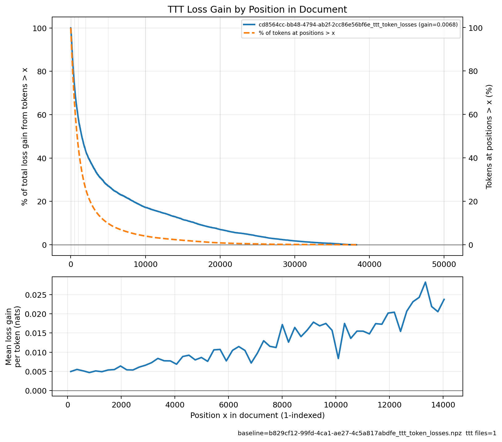

# Record: Varlen attention + fused MLP + TTT

**val_loss: 1.8729 | val_bpb: 1.1093** | **~15.9 MB** | 8×H100 SXM, 600s train + ~500s TTT eval

Increased training speed ~3% via variable length attention and a fused MLP kernel, yielding a ~0.002 nat improvements. Re-added an optimized document-based LoRA TTT that yields a ~0.007 nat improvement. Together, these 3 improve performance ~0.009 nats.

## Main changes

Improves upon record [2026-03-25_ValCalib_GPTQ_XSA_BigramHash3072](https://github.com/openai/parameter-golf/blob/main/records/track_10min_16mb/2026-03-25_ValCalib_GPTQ_XSA_BigramHash3072/README.md) with 3 things:

### 1. Variable length attention (~1% faster training, ~0.001 nats)

Replaced dense causal attention with Flash Attention 3's `flash_attn_varlen_func`. During training, documents are packed into flat token buffers with `cu_seqlens` boundaries so attention is computed within documents only — the model never attends across unrelated documents that happen to be adjacent in a batch.

This does two things:
- Removes the need for the model to learn to ignore pre-BOS content from unrelated documents (val loss is ~.02 nats lower at step 4000).
- Reduces wasted FLOPs: e.g. 10 short (100-token) docs packed into a 1k-token buffer cost proportional to `100 * 100**2 = 1M` attention FLOPs vs `10 * 1000**2 = 10M` with dense attention. This leads to ~1% faster training on 8xH100, and the additional training steps buy ~0.001 nats improvement. This improvement is limited because the model is so small that there is a lot of overhead which is not in the attention so it can only be sped up so much.

### 2. Fused MLP (~1% faster training, ~0.001 nats)

A custom Triton kernel (`linear_leaky_relu_square_kernel`) fuses the up-projection, LeakyReLU(0.5)² activation, and squaring into a single kernel. Based on similar kernels from [modded-nanogpt](https://github.com/KellerJordan/modded-nanogpt/blob/master/triton_kernels.py). Also ~1% faster training on 8xH100, yielding another ~0.001 nats improvement.

### 3. Test-time training (TTT) (~0.007 nats)

> [Blog explaining LoRA-based TTT from past record](https://samacquaviva.com/projects/parameter-golf/)

Re-adds LoRA-based TTT, based on [my old implementation](https://github.com/openai/parameter-golf/blob/main/records/track_10min_16mb/2026-03-17_LoRA_TTT/README.md) which buys **~0.007 nats**. This is an instance of "Case 3" according to [this classification](https://samacquaviva.com/projects/ttt-clarification/). In the previous record, TTT had a mismatch with train: sequences did not attend to other sequences during TTT/eval but did during training. Here, now that we are not attending to other sequences during training, this is avoided (> 70% of training sequences in the old code attended to previous sequences), compared to ~0% now). The bigger improvement comes from using a *smaller chunk size* (32 instead of 256, so more gradient updates per sequence) and *using RMSProp instead of Adam* (just set `beta1=0` for Adam during TTT). To be able to use a smaller chunk size, I had to substantially optimize the TTT speed via vectorizing ops and better batch scheduling system, ~2x'ing the old implementation's speed.

#### TTT analysis

As you can see below, TTT helps the most at later positions in the document (note this is run on 1/10th of the validation set). The top plot is showing, at each position x in a sequence:
1. What % of tokens in the dataset are at later positions?
2. What % of the gain from test-time training comes from tokens at later positions?

Even though only ~5% of the tokens in the dataset are at postion 10k or later in their sequence, > 15% of the loss improvement from TTT comes from those later positions. In the bottom plot, you can see that if we only cared about long-context performance and only looked at positions 10k and up, the gain from TTT would be much greater than 0.01 nats!



## Other small changes and notes

- Removed a lot of dead code just for clarity, but this also got a small speedup as well
- Added some useful dev things, like loading from a checkpoint just for eval
- Counting quantization in "eval time" because it doesn't use training data and it feels wrong to have it not be capped for time

## Run results

```bash
sam:~/parameter-golf# python records/track_10min_16mb/2026-04-04_VarLenAttn/calc_p.py \
    --logs records/track_10min_16mb/2026-04-04_VarLenAttn/seed1-eval.txt \
        records/track_10min_16mb/2026-04-04_VarLenAttn/seed2-eval.txt \
        records/track_10min_16mb/2026-04-04_VarLenAttn/seed1337-total.txt
baseline val_loss: [1.8828 1.8816 1.8822]  mean=1.88220  std=0.000490
new      val_loss: [1.87397897 1.87277334 1.87202097]  mean=1.872924  std=0.000806
delta (baseline - new): 0.009276

baseline val_bpb:  [1.1151 1.1144 1.1148]  mean=1.114767  std=0.000287
new      val_bpb:  [1.1098759  1.10916186 1.10871626]  mean=1.109251  std=0.000478
delta (baseline - new): 0.005515

val delta loss threshold: 0.005
p-value (new is ≥0.005 below baseline): 0.002870
```

Also note that the logs for this run are 5 files, not 3. For seeds 1 and 2, I ran training before implementing/tuning TTT, so to save compute I did not re-run training, but just loaded the checkpoint. For clarity, I will re-run with the final code hopefully later today.

## Replicating runs + dev

```bash
# setup
uv venv
source .venv/bin/activate
uv pip install -r records/track_10min_16mb/2026-04-04_VarLenAttn/requirements.txt
uv pip install --break-system-packages flash_attn_3 --find-links https://windreamer.github.io/flash-attention3-wheels/cu128_torch291
uv pip install torch==2.9.1+cu128 --extra-index-url https://download.pytorch.org/whl/cu128

# download data
python data/cached_challenge_fineweb.py --variant sp1024 --train-shards 80

# train + eval
SEED=0
ARTIFACT_DIR="runs/varlen${SEED}" SEED=$SEED \
    torchrun --standalone --nproc_per_node=8 \
    records/track_10min_16mb/2026-04-04_VarLenAttn/train_gpt.py

# eval saved checkpoint w/ TTT (useful for dev)
EVAL_ONLY_PATH="runs/varlen${SEED}/final_model.int6.ptz" SEED=$SEED \
    torchrun --standalone --nproc_per_node=8 \
    records/track_10min_16mb/2026-04-04_VarLenAttn/train_gpt.py
```
